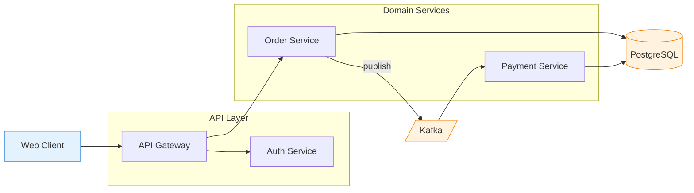
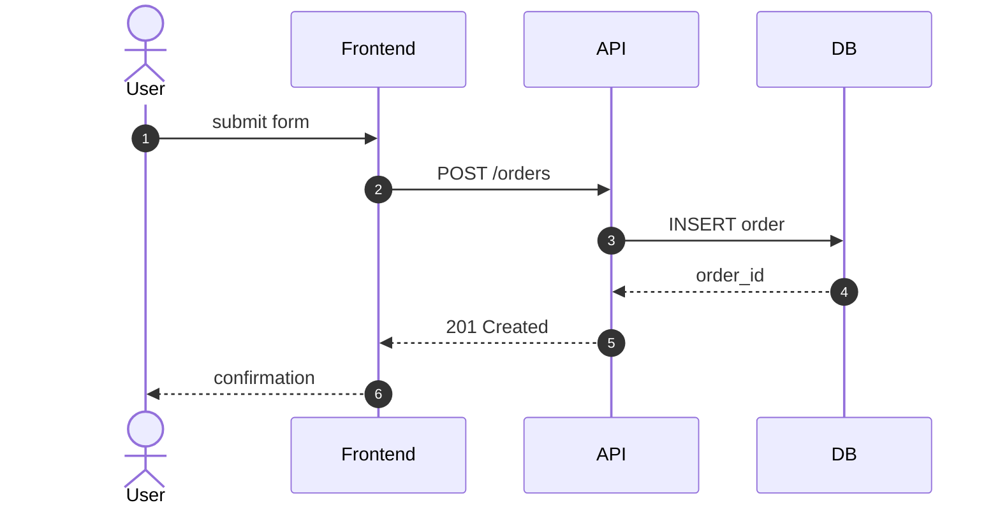
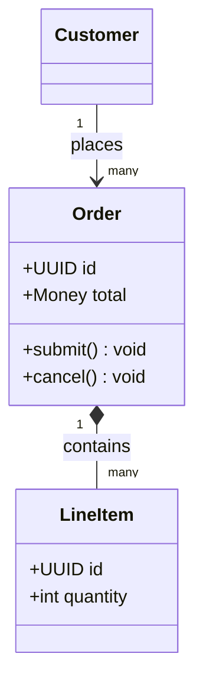
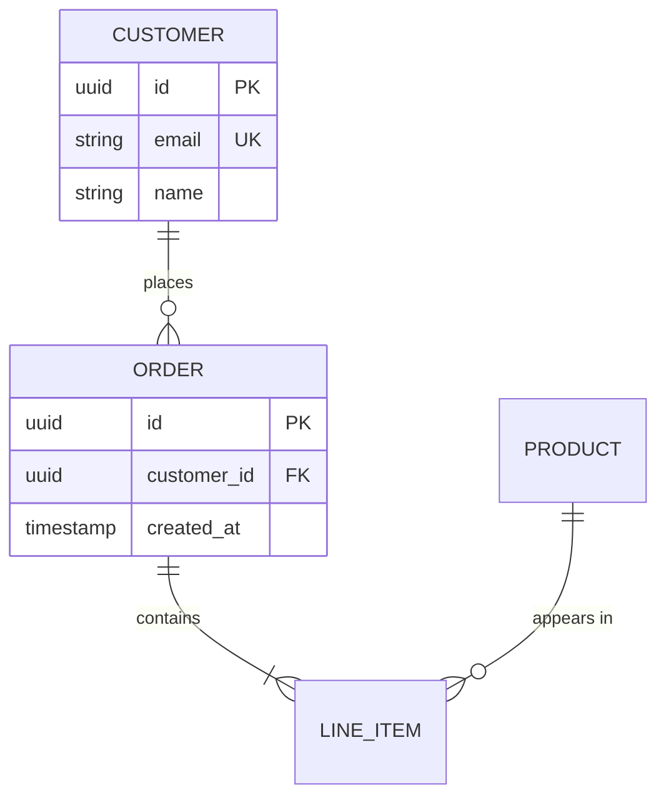
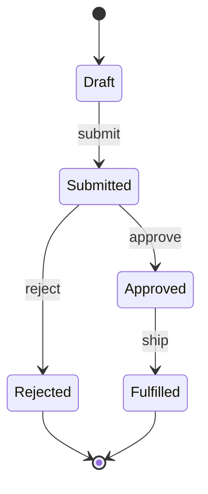

# Create Architecture Diagrams

Produce diagrams that are **correct, readable, and minimal**. A good diagram answers one question; a bad diagram tries to answer all of them.

## When to use which diagram type

Pick the type _before_ writing any Mermaid. The wrong type is the most common reason a diagram is unreadable.

| Question being answered                           | Diagram type                             | Mermaid keyword               |
| ------------------------------------------------- | ---------------------------------------- | ----------------------------- |
| How do components connect at runtime?             | Architecture / flowchart                 | `flowchart LR` or `graph TD`  |
| What happens step-by-step between actors?         | Sequence                                 | `sequenceDiagram`             |
| What is the static OO/type structure?             | Class                                    | `classDiagram`                |
| What does the database schema look like?          | Entity-relationship                      | `erDiagram`                   |
| How does an entity transition between modes?      | State machine                            | `stateDiagram-v2`             |
| How is the system deployed across infrastructure? | C4 deployment / flowchart with subgraphs | `C4Deployment` or `flowchart` |
| What's the user/process journey?                  | Journey                                  | `journey`                     |
| What's the project timeline?                      | Gantt                                    | `gantt`                       |
| How do git branches relate?                       | Git graph                                | `gitGraph`                    |

If the user just says "diagram this", infer from context: backend code → architecture or sequence; schema/models → ER; state-bearing class → state diagram; UI components → flowchart with subgraphs.

## Workflow

1. **Clarify scope.** What's being diagrammed, at what zoom level, and for whom (engineer onboarding? architecture review? debugging?). If unclear and the answer materially changes the output, ask one question; otherwise pick a reasonable default and state it.
2. **Inventory the entities.** List nodes/actors/classes/tables before drawing edges. If the count exceeds ~20, plan to split — see Decomposition below.
3. **Pick the diagram type** using the table above.
4. **Draft the Mermaid.** Follow the syntax patterns and styling rules below.
5. **Validate** against the checklist before returning.

## Mermaid syntax patterns

Wrap every diagram in a fenced block: ` ```mermaid ` ... ` ``` `.

### Flowchart / architecture



Shape conventions: `[Rect]` services, `[(Cylinder)]` databases, `[/Trapezoid/]` queues/streams, `((Circle))` external actors, `{Diamond}` decisions.

### Sequence



Use `autonumber`, `actor` for humans, `participant` for systems. Solid arrow `->>` for calls, dashed `-->>` for responses, `-x` for failures.

### Class



### ER



### State



## Style and layout rules

- **Always declare direction** (`LR`, `TD`, `RL`, `BT`). `LR` for flows with clear input→output; `TD` for hierarchies and trees.
- **Group with `subgraph`** for layers, bounded contexts, deployment zones, or trust boundaries. Quote multi-word labels: `subgraph API["API Layer"]`.
- **Quote labels with special characters.** Use quotes for actor/participant labels with spaces, slashes, or special symbols to prevent syntax errors (e.g., `actor U as "User / Client"`).
- **Label every edge** with a verb or message (`-->|publishes|`, `->>: GET /users`). Unlabeled edges are tolerable only when the relationship is obvious from shape (e.g., ER cardinality).
- **Color by role, not rainbow.** Use `classDef` to mark categories — external systems, datastores, deprecated components, async boundaries. Stick to 3–5 classes max.
- **Naming:** PascalCase for classes/services, camelCase for methods, UPPER_SNAKE for tables/env, kebab-case allowed for infra resources. Be consistent within one diagram.
- **Avoid crossings** by reordering subgraph contents or flipping direction. If crossings remain unavoidable, the diagram is probably too dense.

## Decomposition

If the diagram has more than ~20 nodes, more than ~30 edges, or covers more than one concern, split it. Common axes:

- **By layer** — presentation / application / domain / infrastructure, one diagram each.
- **By bounded context** — orders, payments, inventory as separate diagrams with a high-level "context map" tying them together.
- **By zoom (C4-style)** — system context → containers → components → code. Each level is its own diagram.
- **By scenario** — happy path sequence, error sequence, retry sequence as separate diagrams rather than one with conditionals.

When splitting, name diagrams consistently (`Orders — Container View`, `Orders — Submit Flow`) and link them in surrounding prose.

## Source-specific guidance

- **Backend code:** Map controllers → services → repositories → models/tables. Show external calls (HTTP, queue, cache) explicitly. If there are background workers or scheduled jobs, give them their own subgraph.
- **Frontend code:** Diagram the component tree (parent/child), then separately diagram data/service interactions (component → hook → API client → backend). Don't combine these into one diagram.
- **Database schema:** Use ER. Show PK/FK/UK markers. Skip audit columns (`created_at`, `updated_at`) unless they're load-bearing.
- **Distributed systems:** Mark sync vs async edges differently (solid vs dashed, or labeled). Show trust boundaries as subgraphs. Identify single points of failure visually.
- **Specs / prose only (no code):** Extract nouns → nodes, verbs → edges. Confirm any inferred relationships in surrounding text rather than burying assumptions in the diagram.

## Validation checklist

Before returning the diagram, verify:

- [ ] Mermaid syntax is valid (balanced brackets, quoted multi-word labels, correct arrow tokens for the diagram type).
- [ ] Direction is declared.
- [ ] Every node is reachable; no accidental orphans.
- [ ] Edges have labels where the relationship isn't self-evident.
- [ ] Node count is ≤ ~20; if not, the diagram has been split.
- [ ] Naming convention is consistent within the diagram.
- [ ] If colors/`classDef` are used, every class is actually applied and the meaning is either obvious or stated.
- [ ] The diagram answers one specific question — and it's the question the user asked.

## What to avoid

- Mixing diagram types in one block (e.g., sequence steps inside a flowchart).
- Decorative styling — gradients, drop shadows, custom fonts. Default Mermaid rendering is the target.
- Reproducing the entire codebase as nodes. A diagram is a model, not a mirror.
- Inventing components that aren't in the source. If something is uncertain, mark it (`[Cache?]`) or omit it and note the gap in prose.
