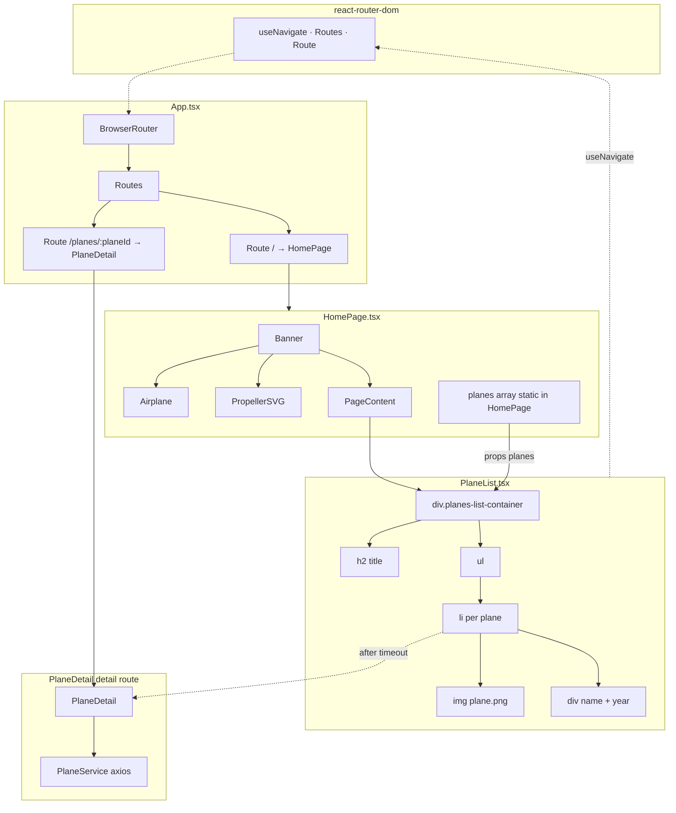

# Planes list — React component hierarchy

Mermaid **flowchart** (`flowchart TB`) for the aviation collection list: composition, static data from the page, React Router usage, and how the detail route uses `PlaneService` after leaving the list.

**Data note:** The list is fed by a **static array** in `HomePage`; `PlaneService` is not used to load the list (only `PlaneDetail` calls it).

## Legend

| Part | Role |
|------|------|
| **App / Routes** | `BrowserRouter` wraps `Routes`; `/` renders the list page; `/planes/:planeId` renders the detail page. |
| **HomePage** | Defines static `planes`, renders `Banner` (with `Airplane`, `PropellerSVG`), then `PageContent` wrapping `PlaneList`. |
| **PageContent** | Layout wrapper only; forwards `children` (`PlaneList`). |
| **PlaneList** | Renders heading, `ul`, and one `li` per plane with thumbnail and text; calls `useNavigate` and `navigate(/planes/${id})` after the fly-away delay. |
| **Dashed edges** | Imperative navigation and hook usage, not React parent/child tree. |
| **PlaneDetail / PlaneService** | Shown because the list navigates here; **not** a child of `PlaneList`. |

## Files

| Concern | Path |
|---------|------|
| Routes | `src/frontend/src/App.tsx` |
| List page + data | `src/frontend/src/pages/HomePage.tsx` |
| List UI | `src/frontend/src/components/PlaneList.tsx` |
| Layout / header | `src/frontend/src/components/PageContent.tsx`, `Banner.tsx`, `Airplane.tsx` |
| API on detail | `src/frontend/src/services/PlaneService.ts` |
