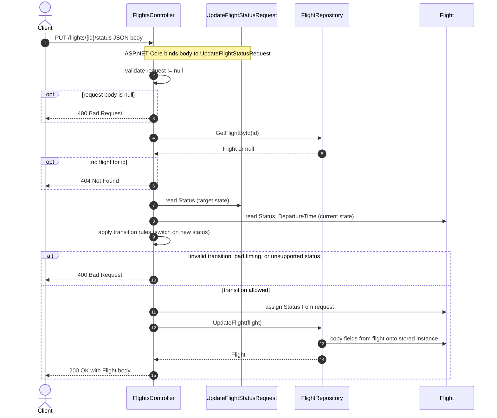

# PUT `/flights/{id}/status` — sequence flow

This diagram shows how a client update moves through `FlightsController`, the request and domain models, and `FlightRepository` for the status update endpoint (`FlightsController.UpdateFlightStatus`).

**Scope:** Request enters the API, the body is bound to `UpdateFlightStatusRequest`, the controller loads a `Flight`, validates the requested `FlightStatus` transition, mutates the entity, persists via the repository, and returns the updated `Flight`. Error responses (400/404) are summarized in the `alt` branch.

## Model roles

| Type | Role |
|------|------|
| `UpdateFlightStatusRequest` | Input DTO; supplies the desired `FlightStatus` after JSON deserialization. |
| `Flight` | Aggregate loaded from the repository; controller updates `Status` after rules pass; repository writes all fields back to the in-memory store. |
