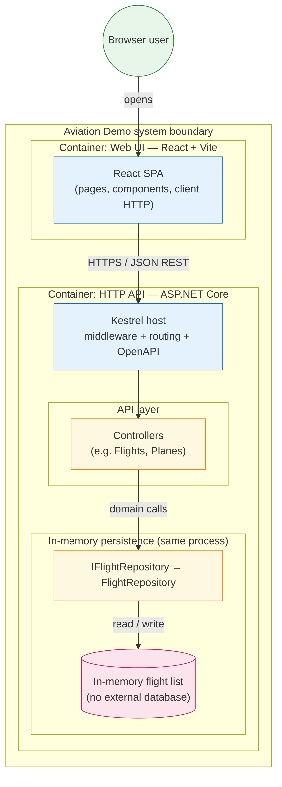

# Aviation Demo — system architecture

High-level **container view** (C4-style): what runs where, and how the main pieces talk to each other. Intended for onboarding (“what talks to what?”).

## Notes

- **Frontend** (`src/frontend`): Vite dev server or static production build; talks to the API over HTTP with JSON (e.g. flight resources).
- **Backend** (`src/backend/AviationApi`): Single ASP.NET Core process; controllers depend on **repository interfaces** implemented by **in-memory** types (`FlightRepository` holds a `List<Flight>` seeded in code).
- **No separate database container** — persistence lives inside the API process only; restarting the API resets in-memory data unless the implementation changes.
